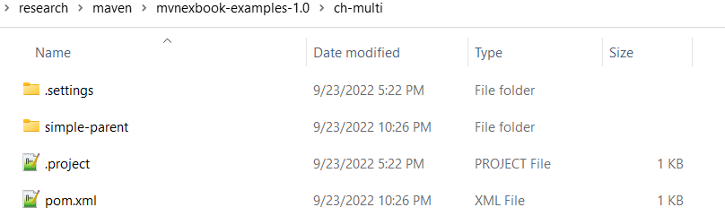
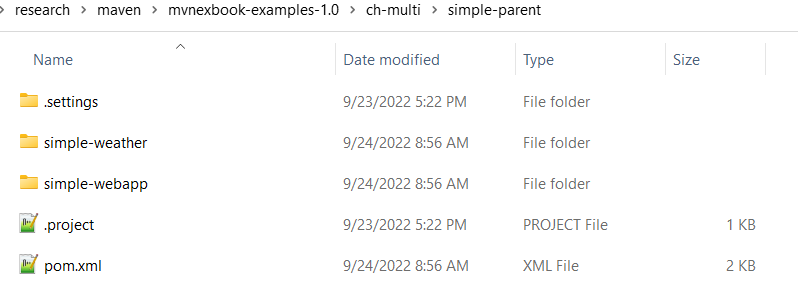
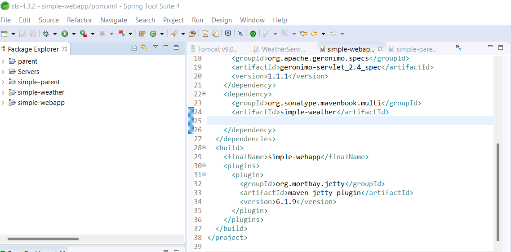
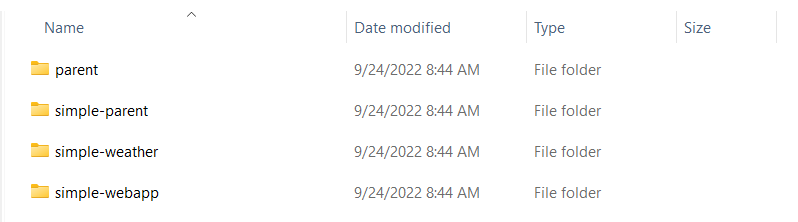
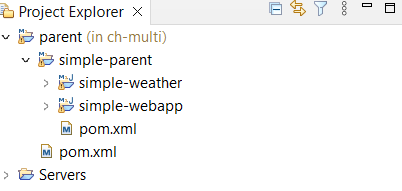

### STS-4.3.2 issues
Project structure:  

STS workspace:  

  

Maven Repo:  

In contrast, Eclipse jee-2022-06 does not create Maven repo for this project.  
Also the project structure is displayed differently in Eclipse jee-2022-06

